 # ShopHub — Plain PHP E‑Commerce
 
 A learning project built with plain PHP and MySQL (XAMPP), deployed on InfinityFree. It demonstrates core e‑commerce features without frameworks, focusing on clean PHP, prepared statements, sessions, and a simple, scalable folder structure.
 
 ## Features
 
 - Product catalog with search, filters, pagination, and categories
 - Product detail with reviews, average rating, and stock status
 - Cart and checkout with session or database persistence
 - Order creation and order history for users
 - User authentication (register/login) with password hashing
 - Admin panel: dashboard, products, users, orders overview
 - Responsive UI with modern CSS and gradient styling
 
 ## Tech Stack
 
 - PHP 7+/8+ (plain PHP)
 - MySQL (via mysqli, prepared statements)
 - Sessions for auth and cart state
 - XAMPP for local development
 - InfinityFree for deployment
 
 ## Project Structure
 
 ```
 ecommerce/
 ├─ index.php
 ├─ config/
 │  └─ database.php
 ├─ includes/
 │  ├─ auth.php
 │  ├─ header.php
 │  ├─ footer.php
 │  ├─ cart_functions.php
 │  ├─ profile_functions.php
 │  └─ process_order.php
 ├─ pages/
 │  ├─ products.php
 │  ├─ product-detail.php
 │  ├─ cart.php
 │  ├─ checkout.php
 │  ├─ orders.php
 │  ├─ order-detail.php
 │  ├─ login.php
 │  └─ register.php
 ├─ admin/
 │  ├─ auth.php
 │  ├─ header.php
 │  ├─ dashboard.php
 │  ├─ orders.php
 │  └─ order-details.php
 ├─ assets/
 │  ├─ css/style.css
 │  ├─ icons/favicon.ico
 │  └─ uploads/profiles/.htaccess
 └─ screenshots/  ← images used below
 ```
 
 ## Database
 
 Connection is defined in [config/database.php](/config/database.php). Update credentials for your environment (XAMPP vs InfinityFree).
 
 ```php
 <?php
 $host = "localhost";
 $user = "root";
 $password = "";
 $databaseName = "ecommerce";
 $conn = mysqli_connect($host, $user, $password, $databaseName);
 if (!$conn) { die("Connection failed"); }
 ?>
 ```
 
 ### Suggested Schema
 
 Use the following minimal schema to get started. Adjust types as needed.
 
 ```sql
 -- users
 CREATE TABLE users (
   id INT AUTO_INCREMENT PRIMARY KEY,
   username VARCHAR(50) UNIQUE,
   email VARCHAR(120) UNIQUE,
   password VARCHAR(255),
   role ENUM('admin','customer') DEFAULT 'customer',
   profile_image VARCHAR(255),
   phone VARCHAR(30),
   created_at TIMESTAMP DEFAULT CURRENT_TIMESTAMP
 );
 
 -- products
 CREATE TABLE products (
   id INT AUTO_INCREMENT PRIMARY KEY,
   name VARCHAR(200),
   description TEXT,
   brand VARCHAR(100),
   category VARCHAR(100),
   price DECIMAL(10,2),
   stock INT DEFAULT 0,
   image VARCHAR(255),
   created_at TIMESTAMP DEFAULT CURRENT_TIMESTAMP
 );
 
 -- cart (database-backed entries for logged-in users)
 CREATE TABLE cart (
   user_id INT,
   product_id INT,
   quantity INT DEFAULT 1,
   PRIMARY KEY (user_id, product_id)
 );
 
 -- orders
 CREATE TABLE orders (
   id INT AUTO_INCREMENT PRIMARY KEY,
   user_id INT,
   status ENUM('pending','processing','completed','cancelled') DEFAULT 'pending',
   total DECIMAL(10,2),
   shipping_name VARCHAR(120),
   shipping_email VARCHAR(120),
   shipping_phone VARCHAR(30),
   shipping_address VARCHAR(255),
   shipping_city VARCHAR(120),
   shipping_state VARCHAR(120),
   shipping_zip VARCHAR(30),
   shipping_country VARCHAR(100) DEFAULT 'USA',
   payment_method ENUM('cash_on_delivery','card') DEFAULT 'cash_on_delivery',
   notes TEXT,
   created_at TIMESTAMP DEFAULT CURRENT_TIMESTAMP
 );
 
 -- order_items
 CREATE TABLE order_items (
   id INT AUTO_INCREMENT PRIMARY KEY,
   order_id INT,
   product_id INT NULL,
   product_name VARCHAR(200),
   quantity INT,
   price DECIMAL(10,2)
 );
 
 -- reviews
 CREATE TABLE reviews (
   id INT AUTO_INCREMENT PRIMARY KEY,
   product_id INT,
   user_id INT,
   rating TINYINT CHECK (rating BETWEEN 1 AND 5),
   review_text TEXT,
   created_at TIMESTAMP DEFAULT CURRENT_TIMESTAMP
 );
 ```
 
 ## Getting Started (Local with XAMPP)
 
 - Place the project under `htdocs/projects/ecommerce`
 - Start Apache and MySQL in XAMPP
 - Create a database named `ecommerce`
 - Import the SQL schema above
 - Update [config/database.php](/config/database.php) if your MySQL credentials differ
 - Open `http://localhost/projects/ecommerce/` in the browser
 
 ## Deployment (InfinityFree)
 
 - Upload the project to your InfinityFree hosting account
 - Create a MySQL database in the InfinityFree control panel
 - Update [config/database.php](/config/database.php) with InfinityFree host, user, and password
 - Ensure file permissions allow reading assets and executing PHP
 
 ## Screenshots
 
 If the `screenshots/` folder is present, images will render below. Image filenames indicate the page shown.
 
 - 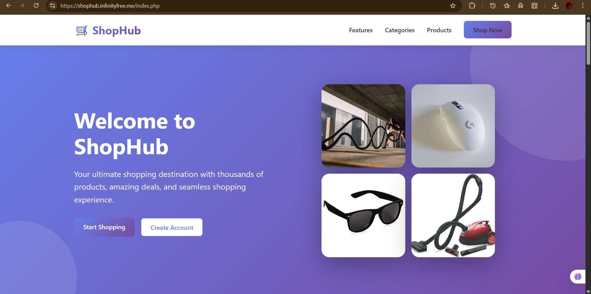
 - 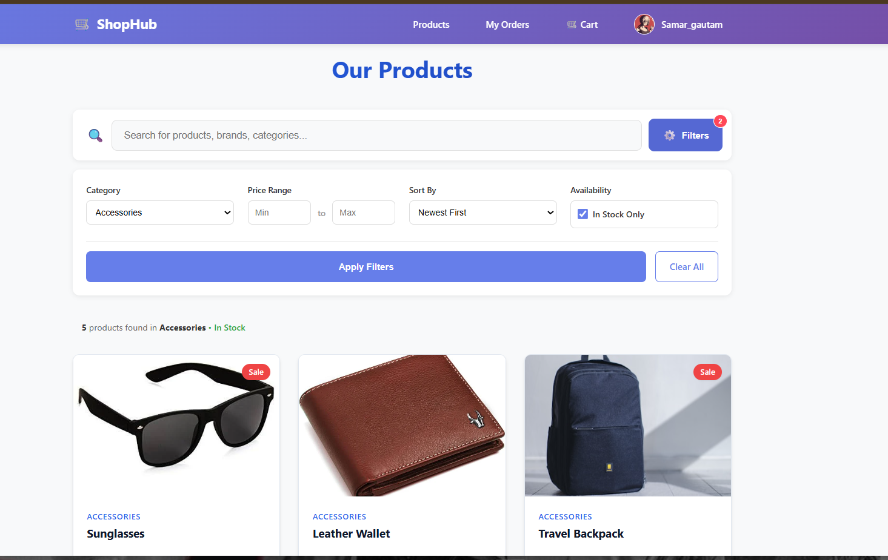
 - 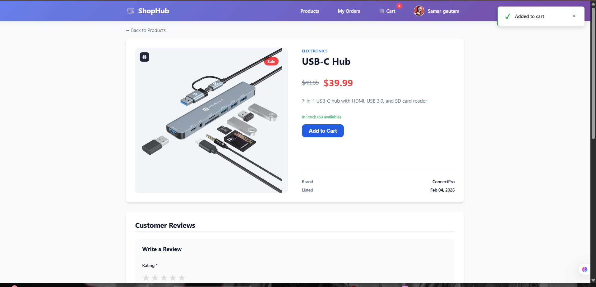
 - 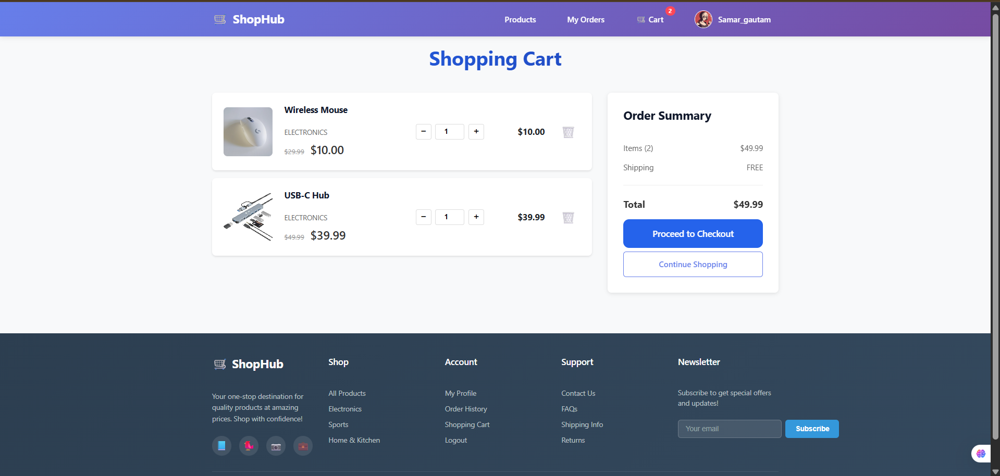
 - 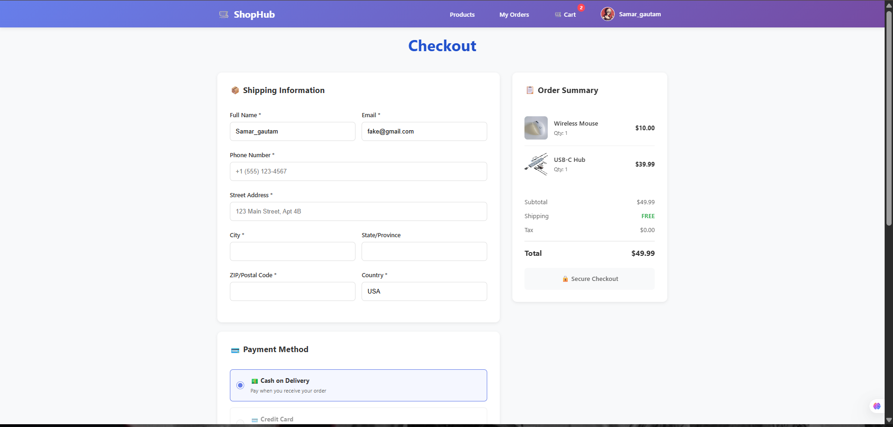
 - 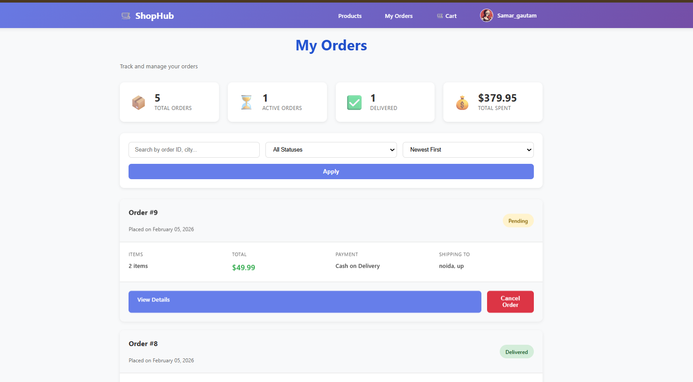
 - 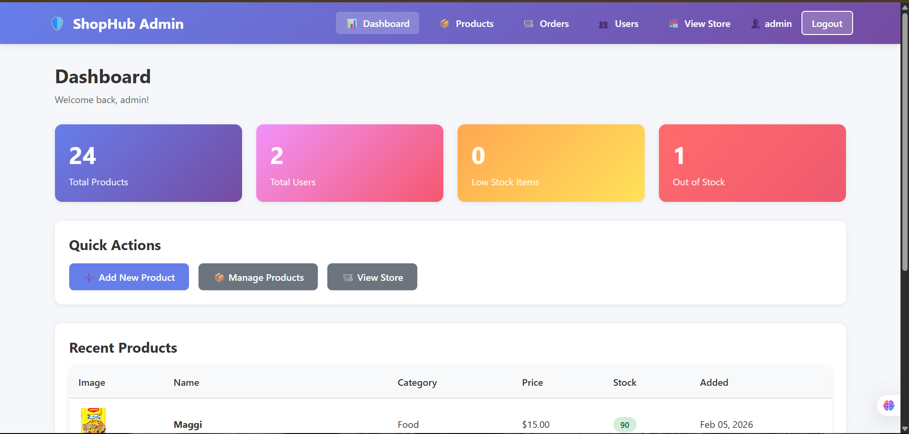
 - 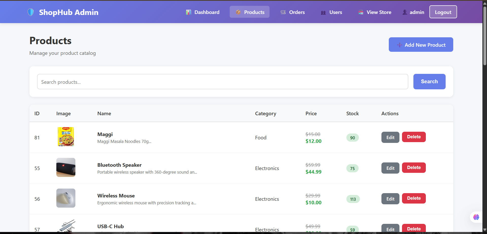
 - 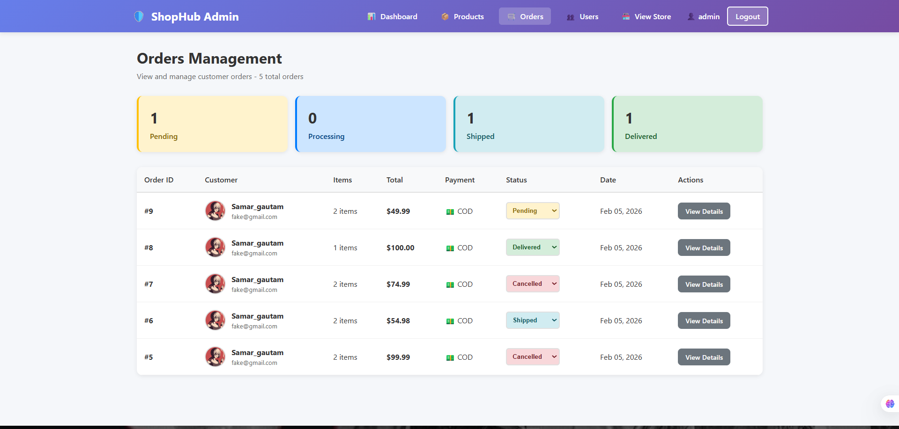
 - 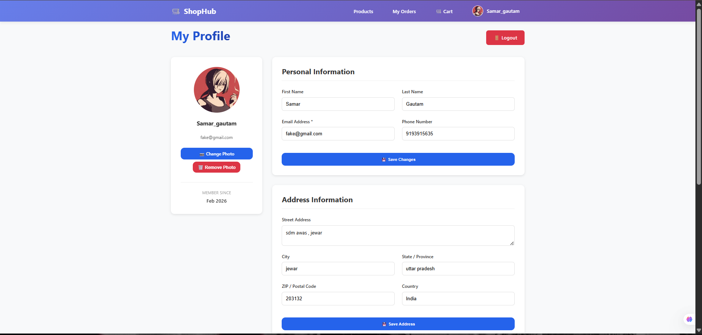
 - 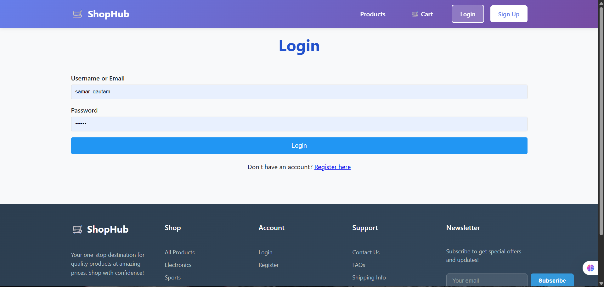
 - 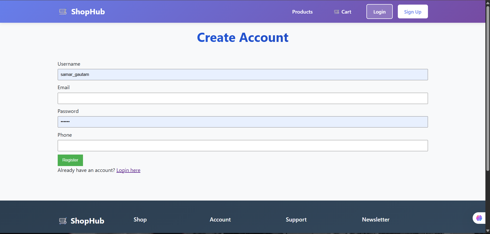
 
 ## Notable Implementation Details
 
 - Prepared statements throughout to avoid SQL injection
 - Session-based auth and cart; cart persists to DB for logged-in users
 - Order flow validates required shipping fields and cart state
 - Simple, consistent, gradient UI defined in [style.css](/assets/css/style.css)
 - Upload safety via `.htaccess` in `assets/uploads/profiles/` to restrict executable files
 
 ## How to Explore
 
 - Landing: [index.php](/index.php)
 - Storefront: [products.php](/pages/products.php)
 - Item page: [product-detail.php](/pages/product-detail.php)
 - Cart & checkout: [cart_functions.php](/includes/cart_functions.php), [checkout.php](/pages/checkout.php)
 - Orders: [orders.php](/pages/orders.php), [order-detail.php](/pages/order-detail.php)
 - Admin: [dashboard.php](/admin/dashboard.php)
 
 ## Credits
 
 Built for learning and to demonstrate plain PHP skills: sessions, security basics, SQL, and UI.
 
