# Software Requirements Specification (SRS)
## ShopHub E-Commerce System

---

## Document Information

| Field | Details |
|-------|---------|
| Project Name | ShopHub - E-Commerce Platform |
| Version | 1.0 |
| Date | April 15, 2026 |
| Prepared By | Development Team |
| Document Status | Final |

---

## Table of Contents

1. [Introduction](#1-introduction)
2. [Overall Description](#2-overall-description)
3. [System Features](#3-system-features)
4. [External Interface Requirements](#4-external-interface-requirements)
5. [System Requirements](#5-system-requirements)
6. [Non-Functional Requirements](#6-non-functional-requirements)
7. [Database Requirements](#7-database-requirements)
8. [Security Requirements](#8-security-requirements)
9. [Appendices](#9-appendices)

---

## 1. Introduction

### 1.1 Purpose
This Software Requirements Specification (SRS) document provides a complete description of the ShopHub E-Commerce System. It details the functional and non-functional requirements for developers, testers, and stakeholders involved in the project.

### 1.2 Scope
ShopHub is a web-based e-commerce platform built with plain PHP and MySQL. The system enables:
- Customers to browse products, manage shopping carts, and place orders
- Administrators to manage products, users, and orders
- Secure user authentication and authorization
- Order tracking and management
- Product reviews and ratings

### 1.3 Definitions, Acronyms, and Abbreviations
- **SRS**: Software Requirements Specification
- **UI**: User Interface
- **CRUD**: Create, Read, Update, Delete
- **COD**: Cash on Delivery
- **XAMPP**: Cross-platform Apache, MySQL, PHP, Perl
- **SQL**: Structured Query Language
- **HTTPS**: Hypertext Transfer Protocol Secure

### 1.4 References
- Project README: `/README.md`
- Admin Documentation: `/admin/README.md`
- Database Configuration: `/config/database.php`

### 1.5 Overview
This document is organized into sections covering system description, features, interface requirements, system requirements, and technical specifications.

---

## 2. Overall Description

### 2.1 Product Perspective
ShopHub is a standalone e-commerce web application designed for small to medium-sized online retail businesses. It operates as a self-contained system with the following components:
- Frontend: HTML, CSS, JavaScript
- Backend: PHP 7+/8+
- Database: MySQL
- Server: Apache (XAMPP for local, InfinityFree for deployment)

### 2.2 Product Functions
The system provides the following major functions:

**Customer Functions:**
- User registration and authentication
- Product browsing with search and filters
- Shopping cart management
- Order placement and tracking
- Product reviews and ratings
- User profile management

**Administrator Functions:**
- Dashboard with statistics
- Product management (CRUD operations)
- User management
- Order management and tracking
- System analytics

### 2.3 User Classes and Characteristics

#### 2.3.1 Guest Users
- Can browse products
- Can search and filter products
- Cannot add to cart or place orders
- Must register to make purchases

#### 2.3.2 Registered Customers
- All guest user capabilities
- Can add products to cart
- Can place and track orders
- Can write product reviews
- Can manage profile information

#### 2.3.3 Administrators
- Full system access
- Manage products, users, and orders
- View system statistics
- Access admin dashboard

### 2.4 Operating Environment
- **Web Server**: Apache 2.4+
- **PHP Version**: 7.4+ or 8.0+
- **Database**: MySQL 5.7+ or MariaDB 10.3+
- **Browser Compatibility**: Chrome, Firefox, Safari, Edge (latest versions)
- **Development Environment**: XAMPP
- **Production Environment**: InfinityFree or similar hosting

### 2.5 Design and Implementation Constraints
- Must use plain PHP (no frameworks)
- Must use prepared statements for SQL queries
- Session-based authentication
- Responsive design for mobile compatibility
- File upload restrictions for security

### 2.6 Assumptions and Dependencies
- Users have internet connectivity
- Users have modern web browsers
- MySQL database is properly configured
- PHP extensions (mysqli) are enabled
- Server has write permissions for upload directories

### 2.7 Application Screenshots Overview

The following screenshots provide a visual overview of the ShopHub e-commerce system:

#### Customer-Facing Interface
| Page | Screenshot |
|------|------------|
| Landing Page |  |
| Product Catalog | 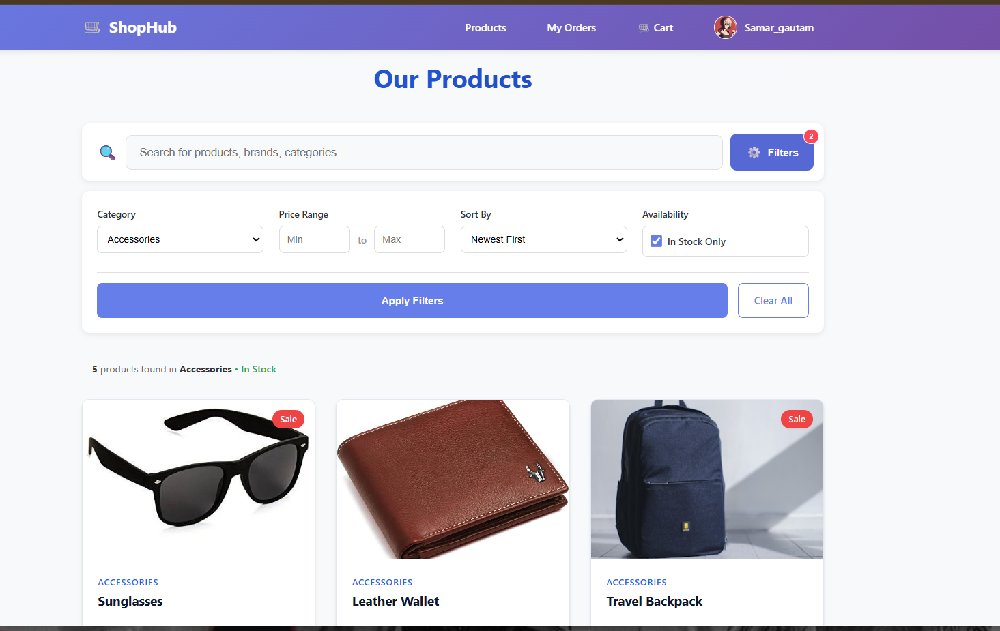 |
| Product Details | 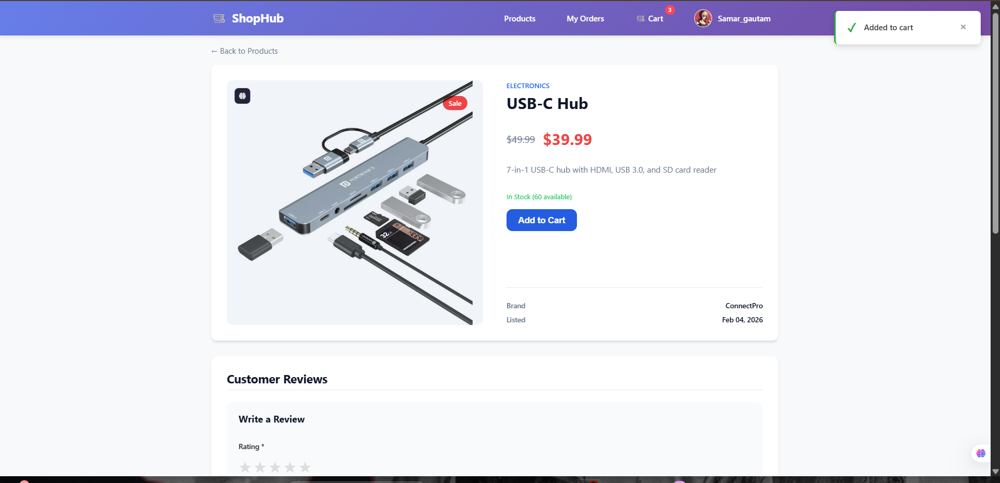 |
| Shopping Cart | 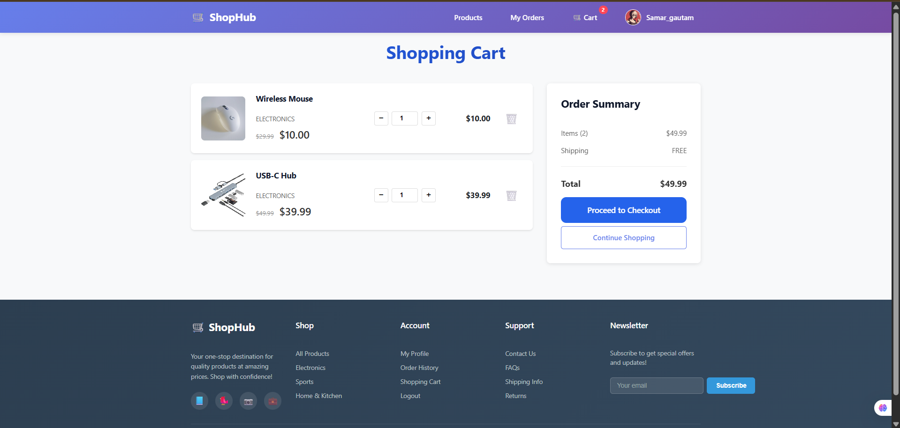 |
| Checkout | 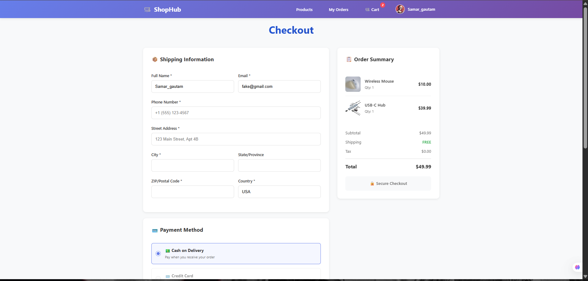 |

#### User Account Management
| Page | Screenshot |
|------|------------|
| Login | 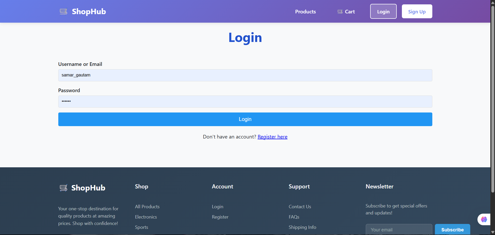 |
| Registration | 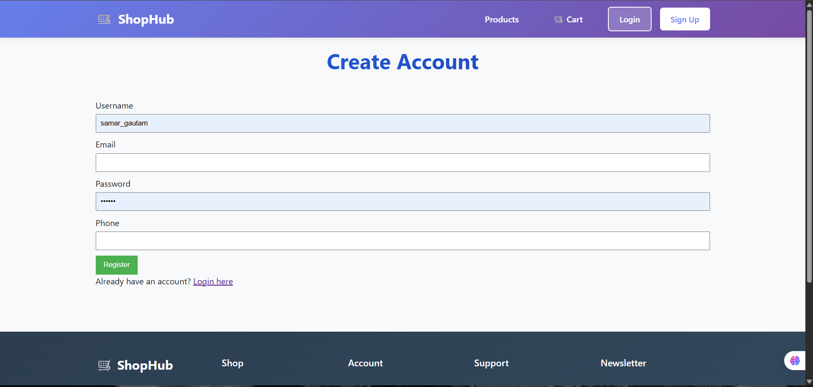 |
| User Profile | 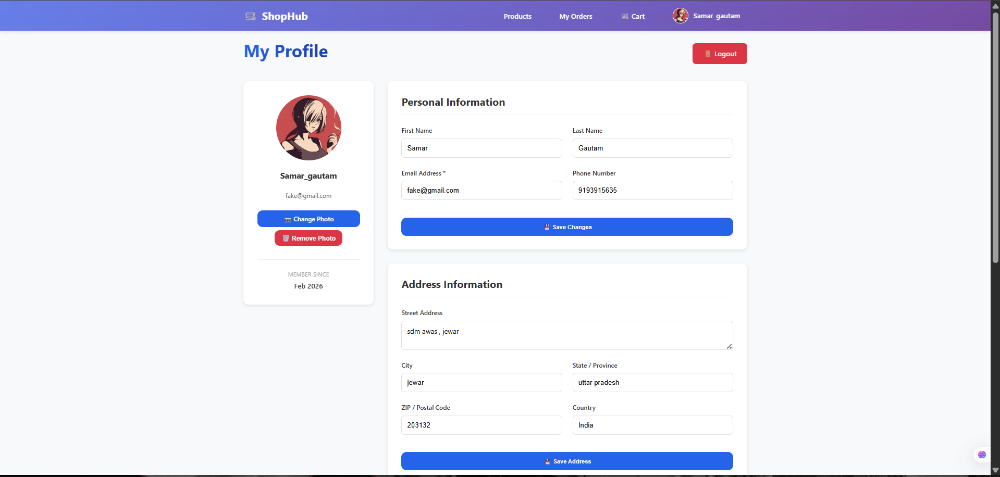 |
| My Orders | 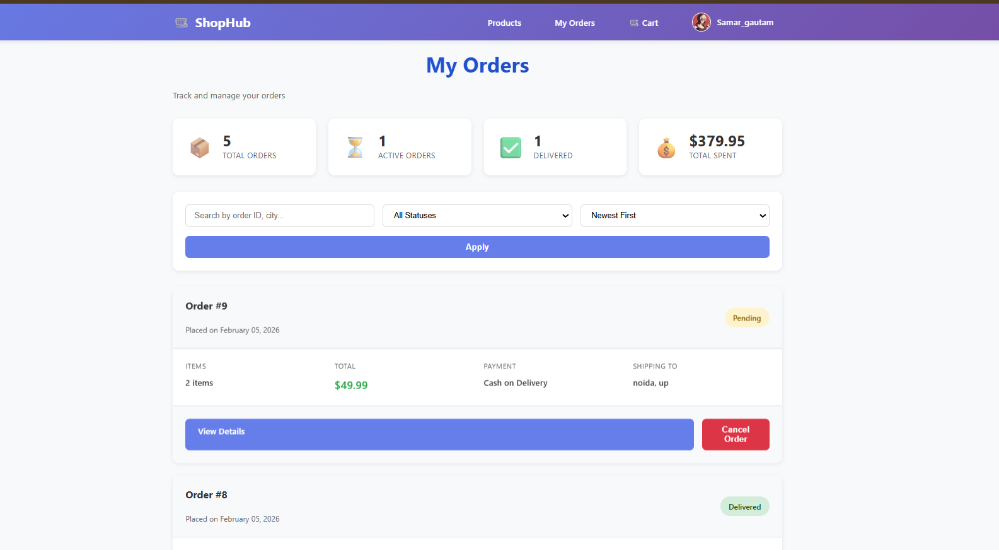 |
| Order Success | 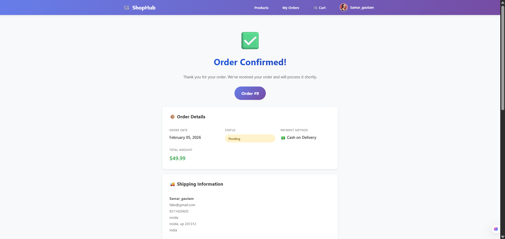 |

#### Admin Panel
| Page | Screenshot |
|------|------------|
| Dashboard | 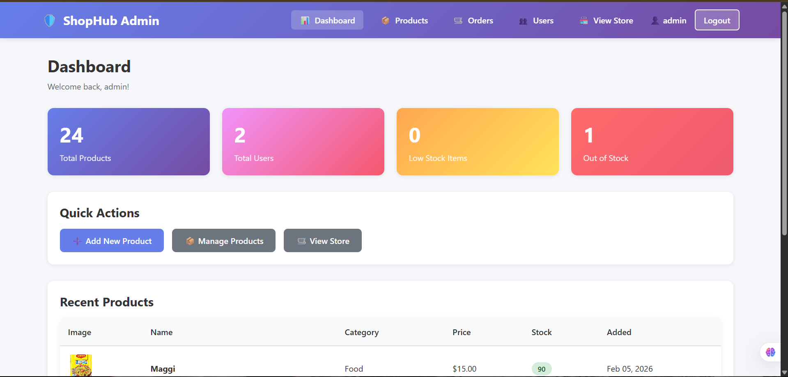 |
| Product Management | 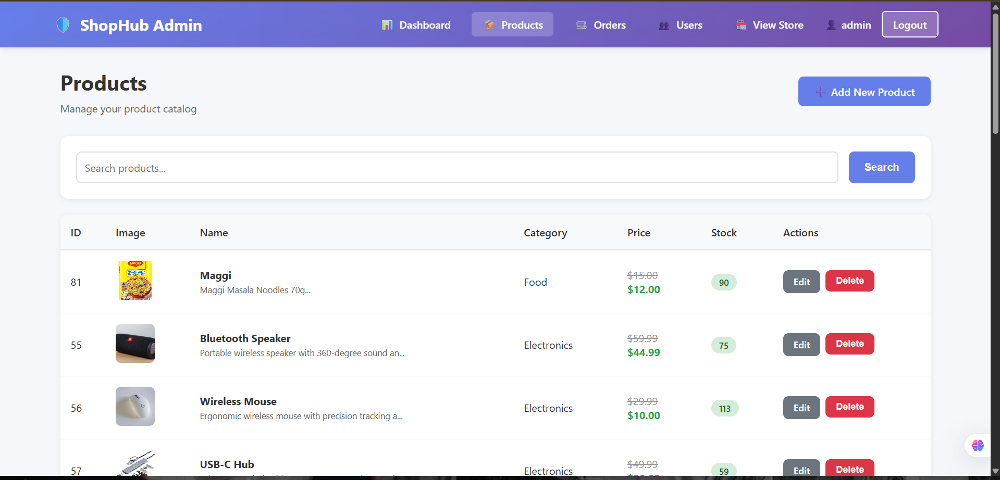 |
| Add Product | 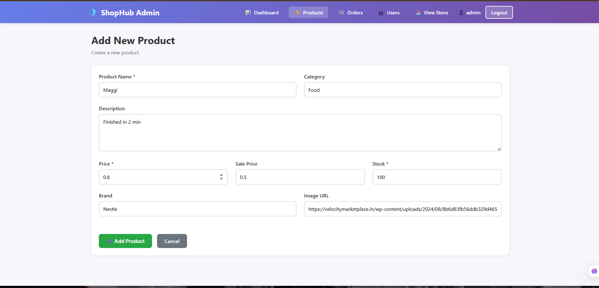 |
| Order Management | 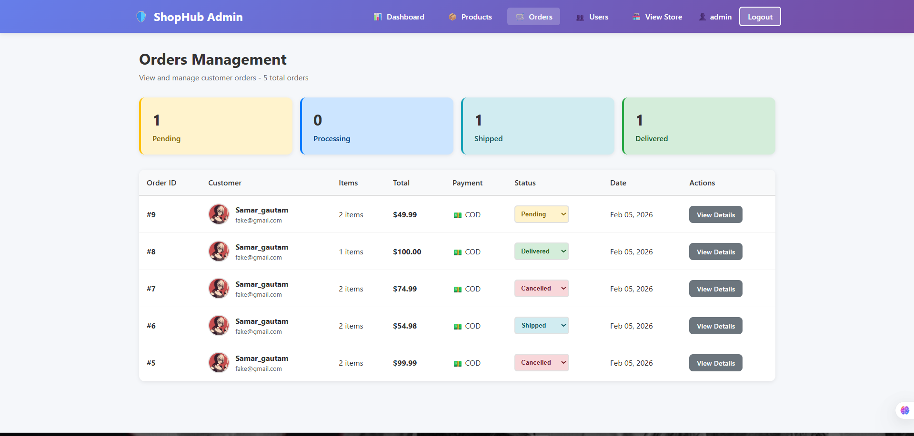 |

---

## 3. System Features

### 3.1 User Authentication and Authorization

#### 3.1.1 Description
Secure user registration, login, and role-based access control system.

#### 3.1.2 Functional Requirements

**FR-1.1**: User Registration
- System shall allow new users to create accounts with username, email, and password
- System shall validate email format and username uniqueness
- System shall hash passwords using bcrypt (password_hash)
- System shall assign 'customer' role by default

**FR-1.2**: User Login
- System shall authenticate users with username/email and password
- System shall create secure sessions upon successful login
- System shall redirect users based on their role (admin/customer)
- System shall display error messages for invalid credentials

**FR-1.3**: User Logout
- System shall destroy user sessions on logout
- System shall redirect to login page after logout

**FR-1.4**: Role-Based Access Control
- System shall restrict admin panel access to users with 'admin' role
- System shall verify user permissions before displaying protected content

### 3.2 Product Management

#### 3.2.1 Description
Complete product catalog management system for administrators and browsing for customers.

#### 3.2.2 Functional Requirements

**FR-2.1**: Product Listing (Customer View)
- System shall display all products with pagination
- System shall show product image, name, category, price, and stock status
- System shall support search by product name
- System shall filter products by category and brand
- System shall sort products by price, name, or date

**FR-2.2**: Product Detail View
- System shall display complete product information
- System shall show product reviews and average rating
- System shall display stock availability
- System shall provide "Add to Cart" functionality
- System shall show related products

**FR-2.3**: Product Management (Admin)
- System shall allow admins to create new products
- System shall allow admins to edit existing products
- System shall allow admins to delete products
- System shall support product image uploads
- System shall validate product data (name, price, stock)

### 3.3 Shopping Cart

#### 3.3.1 Description
Shopping cart system for managing customer product selections.

#### 3.3.2 Functional Requirements

**FR-3.1**: Add to Cart
- System shall allow logged-in users to add products to cart
- System shall validate stock availability before adding
- System shall update quantity if product already in cart
- System shall persist cart in database for logged-in users

**FR-3.2**: View Cart
- System shall display all cart items with images, names, prices
- System shall calculate and display subtotal and total
- System shall show quantity controls for each item

**FR-3.3**: Update Cart
- System shall allow users to change product quantities
- System shall validate quantity against available stock
- System shall recalculate totals automatically

**FR-3.4**: Remove from Cart
- System shall allow users to remove individual items
- System shall update totals after removal

### 3.4 Order Management

#### 3.4.1 Description
Complete order processing system from checkout to delivery tracking.

#### 3.4.2 Functional Requirements

**FR-4.1**: Checkout Process
- System shall display order summary with all cart items
- System shall collect shipping information (name, address, phone, email)
- System shall validate all required shipping fields
- System shall support payment method selection (COD/Card)
- System shall allow optional order notes

**FR-4.2**: Order Placement
- System shall create order record in database
- System shall generate unique order ID
- System shall create order items from cart contents
- System shall clear cart after successful order
- System shall display order confirmation page

**FR-4.3**: Order History (Customer)
- System shall display all user orders with status
- System shall show order date, total, and status
- System shall allow viewing detailed order information
- System shall display order items and shipping details

**FR-4.4**: Order Management (Admin)
- System shall display all orders with filters
- System shall allow viewing order details
- System shall allow updating order status
- System shall show customer and shipping information

### 3.5 Product Reviews and Ratings

#### 3.5.1 Description
Customer review and rating system for products.

#### 3.5.2 Functional Requirements

**FR-5.1**: Submit Review
- System shall allow logged-in users to submit product reviews
- System shall require rating (1-5 stars) and review text
- System shall associate reviews with user and product
- System shall timestamp all reviews

**FR-5.2**: Display Reviews
- System shall display all product reviews on product detail page
- System shall show reviewer name and date
- System shall calculate and display average rating
- System shall show rating distribution

### 3.6 User Profile Management

#### 3.6.1 Description
User profile viewing and editing functionality.

#### 3.6.2 Functional Requirements

**FR-6.1**: View Profile
- System shall display user information (username, email, phone)
- System shall show profile image if uploaded
- System shall display account creation date

**FR-6.2**: Edit Profile
- System shall allow users to update email and phone
- System shall allow profile image upload
- System shall validate image file types and sizes
- System shall update user information in database

### 3.7 Admin Dashboard

#### 3.7.1 Description
Administrative dashboard with system statistics and quick actions.

#### 3.7.2 Functional Requirements

**FR-7.1**: Dashboard Statistics
- System shall display total products count
- System shall display total users count
- System shall display total orders count
- System shall show low stock alerts
- System shall display recent products

**FR-7.2**: Quick Actions
- System shall provide links to add products
- System shall provide links to manage orders
- System shall provide links to manage users

### 3.8 Search and Filter

#### 3.8.1 Description
Advanced product search and filtering capabilities.

#### 3.8.2 Functional Requirements

**FR-8.1**: Search Functionality
- System shall search products by name
- System shall display search results with highlighting
- System shall show "no results" message when applicable

**FR-8.2**: Filter Functionality
- System shall filter products by category
- System shall filter products by brand
- System shall filter products by price range
- System shall allow multiple filters simultaneously

---

## 4. External Interface Requirements

### 4.1 User Interfaces

#### 4.1.1 General UI Requirements
- Responsive design for desktop, tablet, and mobile devices
- Modern gradient-based color scheme (purple/blue gradients)
- Consistent navigation across all pages
- Clear call-to-action buttons
- Toast notifications for user feedback

#### 4.1.2 Customer Interface Pages

1. **Landing Page** (`index.php`)
   - Hero section with featured products
   - Statistics display
   - Category showcase
   - Featured products grid

   

2. **Login Page** (`pages/login.php`)
   - Username/email input field
   - Password input field
   - Login button
   - Link to registration page

   

3. **Registration Page** (`pages/register.php`)
   - User registration form
   - Username, email, password fields
   - Create account button
   - Link to login page

   

4. **Products Page** (`pages/products.php`)
   - Product grid with images
   - Search bar
   - Category and brand filters
   - Pagination controls

   

5. **Product Detail Page** (`pages/product-detail.php`)
   - Large product image
   - Product information
   - Add to cart button
   - Reviews section
   - Related products

   

6. **Shopping Cart** (`pages/cart.php`)
   - Cart items list
   - Quantity controls
   - Price calculations
   - Checkout button

   

7. **Checkout Page** (`pages/checkout.php`)
   - Order summary
   - Shipping information form
   - Payment method selection
   - Place order button

   

8. **Order Success Page** (`pages/order-success.php`)
   - Order confirmation message
   - Order details summary
   - Continue shopping button

   

9. **Orders Page** (`pages/orders.php`)
   - Order history list
   - Order status indicators
   - View details links

   

10. **User Profile** (`pages/profile.php`)
    - Profile information display
    - Edit profile form
    - Profile image upload

    

#### 4.1.3 Admin Interface Pages

1. **Admin Dashboard** (`admin/dashboard.php`)
   - Statistics cards
   - Quick action buttons
   - Recent products table

   

2. **Product Management** (`admin/products.php`)
   - Products table with actions
   - Add product form
   - Edit product form
   - Delete confirmation

   

3. **Add Product Form** (`admin/products.php`)
   - Product information form
   - Image upload
   - Category and brand selection
   - Price and stock management

   

4. **Order Management** (`admin/orders.php`)
   - Orders table with filters
   - Status update controls
   - View details links

   

5. **User Management** (`admin/users.php`)
   - Users table
   - User information display
   - Role management

### 4.2 Hardware Interfaces
- No direct hardware interfaces required
- Standard web server hardware sufficient

### 4.3 Software Interfaces

#### 4.3.1 Database Interface
- **System**: MySQL 5.7+ or MariaDB 10.3+
- **Connection**: mysqli extension
- **Protocol**: TCP/IP
- **Port**: 3306 (default)

#### 4.3.2 Web Server Interface
- **Server**: Apache 2.4+
- **Protocol**: HTTP/HTTPS
- **PHP Module**: mod_php or PHP-FPM

### 4.4 Communication Interfaces
- **Protocol**: HTTP/HTTPS
- **Data Format**: HTML forms, JSON (for AJAX requests)
- **Session Management**: PHP sessions with cookies

---

## 5. System Requirements

### 5.1 Functional Requirements Summary

| ID | Requirement | Priority |
|----|-------------|----------|
| FR-1 | User Authentication and Authorization | High |
| FR-2 | Product Management | High |
| FR-3 | Shopping Cart | High |
| FR-4 | Order Management | High |
| FR-5 | Product Reviews and Ratings | Medium |
| FR-6 | User Profile Management | Medium |
| FR-7 | Admin Dashboard | High |
| FR-8 | Search and Filter | Medium |

### 5.2 Technical Requirements

#### 5.2.1 Server Requirements
- PHP 7.4+ or 8.0+
- Apache 2.4+ with mod_rewrite
- MySQL 5.7+ or MariaDB 10.3+
- Minimum 512MB RAM
- Minimum 1GB disk space

#### 5.2.2 PHP Extensions Required
- mysqli
- gd (for image processing)
- session
- json
- mbstring

#### 5.2.3 Browser Requirements
- Modern browsers with JavaScript enabled
- CSS3 and HTML5 support
- Cookie support for sessions

---

## 6. Non-Functional Requirements

### 6.1 Performance Requirements
- **Page Load Time**: Pages should load within 3 seconds on standard broadband
- **Database Queries**: Optimized queries with proper indexing
- **Concurrent Users**: Support at least 100 concurrent users
- **Image Loading**: Lazy loading for product images
- **Pagination**: Maximum 20 products per page

### 6.2 Security Requirements
- **Password Security**: Bcrypt hashing with cost factor 10
- **SQL Injection Prevention**: Prepared statements for all queries
- **XSS Prevention**: HTML entity encoding for user input
- **Session Security**: Secure session configuration
- **File Upload Security**: Whitelist allowed file types, size limits
- **Access Control**: Role-based authorization checks

### 6.3 Reliability Requirements
- **Uptime**: 99% availability target
- **Error Handling**: Graceful error messages without exposing system details
- **Data Backup**: Regular database backups recommended
- **Transaction Integrity**: ACID compliance for order processing

### 6.4 Usability Requirements
- **Intuitive Navigation**: Clear menu structure
- **Responsive Design**: Mobile-friendly interface
- **User Feedback**: Toast notifications for actions
- **Error Messages**: Clear, actionable error messages
- **Accessibility**: Semantic HTML, alt text for images

### 6.5 Maintainability Requirements
- **Code Organization**: Modular file structure
- **Code Comments**: Inline documentation for complex logic
- **Naming Conventions**: Descriptive variable and function names
- **Separation of Concerns**: Separate includes for different functionalities

### 6.6 Scalability Requirements
- **Database Design**: Normalized schema for data integrity
- **Modular Architecture**: Easy to add new features
- **Configuration Management**: Centralized database configuration
- **Asset Management**: Organized asset directory structure

---

## 7. Database Requirements

### 7.1 Database Schema

#### 7.1.1 Users Table
```sql
CREATE TABLE users (
  id INT AUTO_INCREMENT PRIMARY KEY,
  username VARCHAR(50) UNIQUE NOT NULL,
  email VARCHAR(120) UNIQUE NOT NULL,
  password VARCHAR(255) NOT NULL,
  role ENUM('admin','customer') DEFAULT 'customer',
  profile_image VARCHAR(255),
  phone VARCHAR(30),
  created_at TIMESTAMP DEFAULT CURRENT_TIMESTAMP
);
```

**Purpose**: Store user account information
**Indexes**: PRIMARY KEY (id), UNIQUE (username, email)

#### 7.1.2 Products Table
```sql
CREATE TABLE products (
  id INT AUTO_INCREMENT PRIMARY KEY,
  name VARCHAR(200) NOT NULL,
  description TEXT,
  brand VARCHAR(100),
  category VARCHAR(100),
  price DECIMAL(10,2) NOT NULL,
  stock INT DEFAULT 0,
  image VARCHAR(255),
  created_at TIMESTAMP DEFAULT CURRENT_TIMESTAMP
);
```

**Purpose**: Store product catalog information
**Indexes**: PRIMARY KEY (id), INDEX (category), INDEX (brand)

#### 7.1.3 Cart Table
```sql
CREATE TABLE cart (
  user_id INT NOT NULL,
  product_id INT NOT NULL,
  quantity INT DEFAULT 1,
  PRIMARY KEY (user_id, product_id),
  FOREIGN KEY (user_id) REFERENCES users(id) ON DELETE CASCADE,
  FOREIGN KEY (product_id) REFERENCES products(id) ON DELETE CASCADE
);
```

**Purpose**: Store shopping cart items for logged-in users
**Indexes**: PRIMARY KEY (user_id, product_id)

#### 7.1.4 Orders Table
```sql
CREATE TABLE orders (
  id INT AUTO_INCREMENT PRIMARY KEY,
  user_id INT NOT NULL,
  status ENUM('pending','processing','completed','cancelled') DEFAULT 'pending',
  total DECIMAL(10,2) NOT NULL,
  shipping_name VARCHAR(120) NOT NULL,
  shipping_email VARCHAR(120) NOT NULL,
  shipping_phone VARCHAR(30) NOT NULL,
  shipping_address VARCHAR(255) NOT NULL,
  shipping_city VARCHAR(120) NOT NULL,
  shipping_state VARCHAR(120) NOT NULL,
  shipping_zip VARCHAR(30) NOT NULL,
  shipping_country VARCHAR(100) DEFAULT 'USA',
  payment_method ENUM('cash_on_delivery','card') DEFAULT 'cash_on_delivery',
  notes TEXT,
  created_at TIMESTAMP DEFAULT CURRENT_TIMESTAMP,
  FOREIGN KEY (user_id) REFERENCES users(id)
);
```

**Purpose**: Store order information
**Indexes**: PRIMARY KEY (id), INDEX (user_id), INDEX (status)

#### 7.1.5 Order Items Table
```sql
CREATE TABLE order_items (
  id INT AUTO_INCREMENT PRIMARY KEY,
  order_id INT NOT NULL,
  product_id INT NULL,
  product_name VARCHAR(200) NOT NULL,
  quantity INT NOT NULL,
  price DECIMAL(10,2) NOT NULL,
  FOREIGN KEY (order_id) REFERENCES orders(id) ON DELETE CASCADE,
  FOREIGN KEY (product_id) REFERENCES products(id) ON DELETE SET NULL
);
```

**Purpose**: Store individual items within orders
**Indexes**: PRIMARY KEY (id), INDEX (order_id)

#### 7.1.6 Reviews Table
```sql
CREATE TABLE reviews (
  id INT AUTO_INCREMENT PRIMARY KEY,
  product_id INT NOT NULL,
  user_id INT NOT NULL,
  rating TINYINT NOT NULL CHECK (rating BETWEEN 1 AND 5),
  review_text TEXT,
  created_at TIMESTAMP DEFAULT CURRENT_TIMESTAMP,
  FOREIGN KEY (product_id) REFERENCES products(id) ON DELETE CASCADE,
  FOREIGN KEY (user_id) REFERENCES users(id) ON DELETE CASCADE
);
```

**Purpose**: Store product reviews and ratings
**Indexes**: PRIMARY KEY (id), INDEX (product_id), INDEX (user_id)

### 7.2 Database Relationships
- Users (1) → Orders (Many)
- Users (1) → Cart (Many)
- Users (1) → Reviews (Many)
- Products (1) → Cart (Many)
- Products (1) → Order Items (Many)
- Products (1) → Reviews (Many)
- Orders (1) → Order Items (Many)

### 7.3 Data Integrity Rules
- All foreign keys have appropriate CASCADE or SET NULL actions
- Email and username must be unique
- Passwords must be hashed before storage
- Prices and totals use DECIMAL for precision
- Ratings constrained to 1-5 range
- Order status limited to predefined values

---

## 8. Security Requirements

### 8.1 Authentication Security
- Passwords hashed using PHP's `password_hash()` with bcrypt
- Session-based authentication with secure session configuration
- Automatic session timeout after inactivity
- Logout functionality to destroy sessions

### 8.2 Authorization Security
- Role-based access control (admin/customer)
- Admin panel protected by role verification
- User-specific data access restrictions
- Authorization checks before sensitive operations

### 8.3 Input Validation
- Server-side validation for all user inputs
- Email format validation
- Phone number format validation
- File type and size validation for uploads
- SQL injection prevention via prepared statements

### 8.4 Output Encoding
- HTML entity encoding using `htmlspecialchars()`
- XSS prevention for user-generated content
- Safe display of product names, descriptions, reviews

### 8.5 File Upload Security
- Whitelist allowed file extensions (jpg, jpeg, png, gif)
- File size limits enforced
- `.htaccess` in upload directory to prevent script execution
- Unique filename generation to prevent overwrites

### 8.6 Database Security
- Prepared statements for all SQL queries
- Least privilege principle for database user
- No direct SQL query construction from user input
- Connection credentials stored in separate config file

### 8.7 Session Security
- Secure session configuration
- Session regeneration after login
- HttpOnly and Secure flags for session cookies (when using HTTPS)
- Session data validation

---

## 9. Appendices

### 9.1 Project Structure
```
ecommerce/
├── index.php                    # Landing page
├── config/
│   └── database.php            # Database configuration
├── includes/
│   ├── auth.php                # Authentication functions
│   ├── header.php              # Common header
│   ├── footer.php              # Common footer
│   ├── cart_functions.php      # Cart operations
│   ├── cart_api.php            # Cart AJAX endpoints
│   ├── profile_functions.php   # Profile operations
│   ├── process_order.php       # Order processing
│   ├── search_api.php          # Search functionality
│   ├── toast.php               # Notification system
│   ├── addToCart.php           # Add to cart handler
│   ├── updateCart.php          # Update cart handler
│   └── removeFromCart.php      # Remove from cart handler
├── pages/
│   ├── products.php            # Product listing
│   ├── product-detail.php      # Product details
│   ├── cart.php                # Shopping cart
│   ├── checkout.php            # Checkout process
│   ├── orders.php              # Order history
│   ├── order-detail.php        # Order details
│   ├── order-success.php       # Order confirmation
│   ├── login.php               # User login
│   ├── register.php            # User registration
│   ├── logout.php              # Logout handler
│   └── profile.php             # User profile
├── admin/
│   ├── auth.php                # Admin authentication
│   ├── header.php              # Admin header
│   ├── dashboard.php           # Admin dashboard
│   ├── products.php            # Product management
│   ├── orders.php              # Order management
│   ├── order-details.php       # Order details (admin)
│   ├── users.php               # User management
│   ├── login.php               # Admin login
│   ├── logout.php              # Admin logout
│   └── README.md               # Admin documentation
├── assets/
│   ├── css/
│   │   └── style.css           # Main stylesheet
│   ├── icons/                  # Favicon and icons
│   ├── uploads/
│   │   └── profiles/           # Profile image uploads
│   └── placeholder.png         # Default product image
└── screenshots/                # Application screenshots
```

### 9.2 Technology Stack Details

#### Frontend Technologies
- HTML5 for semantic markup
- CSS3 for styling and animations
- Vanilla JavaScript for interactivity
- Responsive design with CSS Grid and Flexbox

#### Backend Technologies
- PHP 7.4+/8.0+ for server-side logic
- mysqli extension for database operations
- Session management for state persistence

#### Database
- MySQL 5.7+ or MariaDB 10.3+
- InnoDB storage engine for ACID compliance
- UTF-8 character encoding

#### Development Tools
- XAMPP for local development
- Any text editor or IDE (VS Code, PHPStorm, etc.)
- MySQL Workbench or phpMyAdmin for database management

#### Deployment
- InfinityFree or similar PHP hosting
- cPanel or similar control panel
- FTP/SFTP for file transfer

### 9.3 Installation Steps

#### Local Development (XAMPP)
1. Install XAMPP
2. Place project in `htdocs/ecommerce`
3. Start Apache and MySQL
4. Create database named `ecommerce`
5. Import database schema
6. Update `config/database.php` with credentials
7. Access via `http://localhost/ecommerce`

#### Production Deployment
1. Upload files to hosting account
2. Create MySQL database via control panel
3. Import database schema
4. Update `config/database.php` with production credentials
5. Set appropriate file permissions
6. Test all functionality

### 9.4 Default Admin Credentials
- **Username**: admin
- **Email**: admin@shophub.com
- **Password**: admin123
- **Note**: Change password after first login

### 9.5 Future Enhancements
- Email notifications for orders
- Password reset functionality
- Wishlist feature
- Product comparison
- Advanced analytics dashboard
- Multi-currency support
- Coupon and discount system
- Inventory management alerts
- Customer support chat
- Social media integration

### 9.6 Known Limitations
- No email functionality (requires SMTP configuration)
- Basic search (no full-text search)
- Single currency (USD)
- No real payment gateway integration
- Limited admin user management
- No automated testing suite

### 9.7 Browser Compatibility Matrix

| Browser | Minimum Version | Status |
|---------|----------------|--------|
| Chrome | 90+ | Fully Supported |
| Firefox | 88+ | Fully Supported |
| Safari | 14+ | Fully Supported |
| Edge | 90+ | Fully Supported |
| Opera | 76+ | Fully Supported |
| Mobile Safari | iOS 14+ | Fully Supported |
| Chrome Mobile | Android 90+ | Fully Supported |

### 9.8 Glossary

- **Cart Persistence**: Storing cart data in database for logged-in users
- **Prepared Statement**: SQL query template that prevents injection attacks
- **Session**: Server-side storage for user state across requests
- **Role-Based Access Control (RBAC)**: Authorization based on user roles
- **CRUD**: Create, Read, Update, Delete operations
- **Responsive Design**: UI that adapts to different screen sizes
- **Toast Notification**: Brief message that appears temporarily
- **Pagination**: Dividing content into discrete pages
- **Lazy Loading**: Loading images only when needed
- **Bcrypt**: Password hashing algorithm

---

## Document Approval

| Role | Name | Signature | Date |
|------|------|-----------|------|
| Project Manager | | | |
| Lead Developer | | | |
| QA Lead | | | |
| Client Representative | | | |

---

**End of Document**
